# Request to Meme 😂
This repository is an index of memes. The meme can be about anything, but it **must be workplace appropriate**. Make sure to add a link to your GitHub profile under 'submitted by' and a image source under 'source'.

## How to Contribute
Clone this repository (or open in codespace). Create an issue with a meme description you plan to add. Create a branch with the issue number, your initials and a brief description (something like this "1-ih-add-cat-meme"). Add your meme, commit, push branch, and create a pull request into main branch. Pull requests must have at least 2 approvals before being merged. Link the pull request using [closing keywords](https://docs.github.com/en/issues/tracking-your-work-with-issues/linking-a-pull-request-to-an-issue) to associate the pull request with your issue. Do not commit directly to main!

## Memes

| Meme | Submitted By | Source |
| -------- | ------- | ------- |
|  | [Jat Karboe](https://github.com/melo616) | [source](https://dashboard.dpi.dev/cohorts/126be8e2-7a8d-4725-8509-d6e8a48dbbe8/enrollments/ad22c5bf-4269-4af0-bd89-f7915c9f8298/snapshot) |
|  | [Ian Heraty](https://github.com/heratyian) | [source](https://wallpapers.com/images/featured-full/cat-meme-pictures-9anza1hu2l2k0wyp.jpg) |
|  | [Brian Waddell](https://github.com/Brian-Waddell) | [source](https://scontent-ord5-2.xx.fbcdn.net/v/t39.30808-6/278198975_3069239186721300_8146581222467992731_n.jpg?_nc_cat=104&ccb=1-7&_nc_sid=5f2048&_nc_ohc=kJ-BD7YozQwAX9udrWB&_nc_ht=scontent-ord5-2.xx&oh=00_AfDBefafzBfNjg6qUA1gAL0LyRviO4bRgUg4AUqf1pkkrA&oe=653D8F44) |
|  | [Mena Castillo](https://github.com/Meenoow) | [source](https://medium.com/agileactors/program-memes-45f69695457e) |
|  | [RJ](https://github.com/RJDPI) | [source](https://img-aws.ehowcdn.com/700x/cdn.onlyinyourstate.com/wp-content/uploads/2018/02/Facebook_Chicago-Memes12-700x704.jpg) |
|  | [Ian Heraty](https://github.com/heratyian) | [source](https://twitter.com/daboigbae/status/1698017944478130210?s=12)
|  | [Thierry Chau](https://github.com/thierrychau) | [source](https://sm.mashable.com/t/mashable_sea/photo/default/2_6n5e.2496.png) |
|  | [Alina Sapronova](https://github.com/AlinaSapronova) | [source](https://bascomtelephone.com/community/latest-news/best-tech-memes-2020/) |
|  | [Sam Lubliner](https://github.com/Samuel-Lubliner) | [source](https://www.youtube.com/watch?v=Uo3cL4nrGOk) |
|  | [David Hibble](https://github.com/hibbleD) | [source](https://www.happierhuman.com/funny-memes-work-stress/) |
|  | [Andre Garner](https://github.com/ajgarner98) | [source](https://imgb.ifunny.co/images/0667ce7b82216c72216e82e5946a1fed0b452a2ffe5893eee84737c29d2dd079_1.jpg) |
|  | [Jason Ho](https://github.com/jasonho404) | [source](https://www.pinterest.com/pin/found-on-americas-best-pics-and-videos--782430135277693078/) |
| | [Jacob Hoffmann](https://github.com/jacobhoffmann257) | [source](https://media4.giphy.com/media/v1.Y2lkPTc5MGI3NjExa25zcTlocTdpdTNvc3hubHk3enJuOG51Zmh1dHoweGpuYXZpZ3psbSZlcD12MV9pbnRlcm5hbF9naWZfYnlfaWQmY3Q9cw/giLKqcYUzgoUe9tioR/giphy.gif)
| | [Andrew Cook](https://github.com/andrewhcook) | [source](https://media.makeameme.org/created/one-does-not-zjxkyt.jpg) |
|  | [Alex Mompremier](https://github.com/ajmompr) | [source](https://www.ntaskmanager.com/wp-content/uploads/2018/03/Oprah-meetings-meme-1.png) |
|  | [Fidel Leal](https://github.com/fidel-techprep) | [source](https://i0.wp.com/roomescapeartist.com/wp-content/uploads/2016/07/coffee-meme-hello-darkness-my-old-friend.jpg?ssl%253D1) |
|  | [Aldo Portillo](https://github.com/aldoportillo) | [source](https://pbs.twimg.com/media/FsXbMgoWcAAut83.jpg) |
|  | [Sara Schoonover](https://github.com/saraschoonover) | [source](https://media.sproutsocial.com/uploads/meme-example.jpg) |
|  | [Brenda Reyes](https://github.com/brendareyes-techprep) | [source](https://www.reddit.com/r/ProgrammerHumor/comments/ayvwjo/confused_screaming/) |
|  | [Carlos Castaneda](https://github.com/CarlosCastanedaDev) | [source](https://images.app.goo.gl/iQ7RNtfAMFb4x5yB6) |
|  | [Jared Bears](https://github.com/JaredBears) | [source](https://www.instagram.com/p/CMfOcLEh6ff/) |
|  | [Jun So](https://github.com/thatcantbeso) | [source](https://twitter.com/KennethCassel/status/1710048342535753795) |
|  | [Kat Jarboe](https://github.com/melo616) | [source](https://knowyourmeme.com/photos/1439882-coughing-cat) |
|  | [Thierry Chau](https://github.com/thierrychau) | [source](https://sm.mashable.com/t/mashable_sea/photo/default/2_6n5e.2496.png) |
|  | [Jorge Pioquinto](https://github.com/Jorge-Pioquinto) | [source](https://i.pinimg.com/originals/f6/9b/76/f69b76501091fa5fb0e026a6a23ecbbe.jpg) |
|  | [Akin Campbell](https://github.com/akincampbell) | [source](https://www.rd.com/wp-content/uploads/2023/04/Hilarious-Cat-Memes-2.jpg?fit=700%2C700?fit=700,700) |
|  | [Calvin Armstrong](https://github.com/armstrca) | [source](https://i.ibb.co/hszQB7G/Screenshot-20231025-134628-2.png) |
|  | [Chierry Thau](https://github.com/thierrychau) | [source](https://dashboard.dpi.dev/cohorts/126be8e2-7a8d-4725-8509-d6e8a48dbbe8/enrollments/2713d7ec-cd2a-4bc0-bc47-469cd4d567cc/snapshot) |
|  | [Carman Chiu](https://github.com/chiucarman) | [Source](https://imgflip.com/i/6n6qu2) |
|  | [Dmitrii Sumenko](https://github.com/flstudio4) | [source](https://www.newshub.co.nz/home/lifestyle/2019/08/the-top-five-cat-memes-of-all-time-rated.html) |
|  | [Alejandro Lopez](https://github.com/alejlopez139) | [source](https://pbs.twimg.com/media/FMTJZP4VgAEWxxr?format=jpg&name=large)
|  | [Chierry Thau](https://github.com/armstrca) | [source](https://dashboard.dpi.dev/cohorts/126be8e2-7a8d-4725-8509-d6e8a48dbbe8/enrollments/2713d7ec-cd2a-4bc0-bc47-469cd4d567cc/snapshot) |
|  | [Ethan Huang](https://github.com/EthanKH) | [source](https://uploads-ssl.webflow.com/5f3c19f18169b62a0d0bf387/60d33be7eedf8e1f31aabcec_BwENfmI0CU5dZGYlSyo142mpfG08-rYgTS-Qm47uMUXN6JXtmdZvtzVzTooUQdXTWmTD8uzF9N6XQJA2vUIMi53tunFyVtvOBJTNfOjHit2P_JkTmFzFsK7ep6Vb9781XZnRAryH.png) |
|  | [Chierry Thau](https://github.com/armstrca) | [source](https://dashboard.dpi.dev/cohorts/126be8e2-7a8d-4725-8509-d6e8a48dbbe8/enrollments/2713d7ec-cd2a-4bc0-bc47-469cd4d567cc/snapshot) |

# indecisive flapjacks
| Meme | Submitted By | Source |
| -------- | ------- | ------- |
|  | [Cisco Vlahakis](https://github.com/ciscovlahakis) | [source](https://cdn.sanity.io/images/hgftikht/production/5c052ea60569a7bb10d063d64cc4e65b7e5479ef-894x1206.png?fm=webp) |
|   | [Annie Huynh](https://github.com/ahuynh3a) | [source](https://imgflip.com/i/7mvtlt) |
|  | [Shay Scott](https://github.com/kscott675) | [source](https://www.pinterest.com/pin/433330795413169170/) |
|  | [Jeeho Lee](https://github.com/jeeheezy) | [source](https://imgflip.com/i/8idrc4) |
|  | [Gustavo Gutierrez](https://github.com/evolshenanigans) | [source](https://m.facebook.com/nixcraft/photos/6160586470621346/) |
|  | [Reid Aumann](https://github.com/reidaumann) | [source](https://pleated-jeans.com/2023/10/14/funniest-programming-memes-from-this-week-october-14-2023/) |
|  | [Maurius Hill](https://github.com/mauriushill) | [source](https://learn.codefellows.org/contact?utm_audience=students&utm_promo_code=not_applicable&utm_sequence_type=not_applicable&utm_partner=0016100000M954d&utm_source=how-to_apply_page-get_in_touch&utm_medium=website&utm_content=how_to_apply_page-get_in_touch&utm_campaign=coding_for_beginners&utm_term=not_applicable&utm_campaign_id=not_applicable&utm_ad_id=not_applicable&utm_adset_id=not_applicable&utm_adset_name=not_applicable&utm_placement=not_applicable&utm_start=not_applicable&utm_cost=organic) |
|  | [Salvador Castaneda](https://github.com/salcasta) | [source](https://medium.com/@daboigbae/five-hilarious-javascript-memes-you-cant-miss-9a8b503d6f6f) |
|  | [Eduardo Villa](https://github.com/evilla092) | [source](https://preview.redd.it/dontmakemetypeitoutagain-v0-fxukx6y2iwmc1.png?auto=webp&s=cba746562907751e1196330f4c2a57b258926baa) |
|  | [Salvador Castaneda](https://github.com/salcasta) | [source](https://medium.com/@daboigbae/five-hilarious-javascript-memes-you-cant-miss-9a8b503d6f6f) |
|  | [Benjamin Guzman-Ayala](https://github.com/BenjaminGuzman-Ayala) | [source](https://www.shutterstock.com/search/coding-memes?image_type=illustration) |
|  | [Eduardo Villa](https://github.com/evilla092) | [source](https://preview.redd.it/dontmakemetypeitoutagain-v0-fxukx6y2iwmc1.png?auto=webp&s=cba746562907751e1196330f4c2a57b258926baa) |
|  | [David Le](https://github.com/DavidVLe1) | [source](https://www.google.com/url?sa=i&url=https%3A%2F%2Fimgflip.com%2Fmemegenerator%2F171457391%2FYhorm-Dark-Souls&psig=AOvVaw1NXRP49sD037Y1cSpo51iu&ust=1709914567493000&source=images&cd=vfe&opi=89978449&ved=0CBMQjRxqFwoTCLDg7aTG4oQDFQAAAAAdAAAAABAJ) |
|  | [John Paul Fababaer](https://github.com/jpfababaer) | [source](https://i.imgflip.com/8ie56l.jpg)
|  | [Andrew Pham](https://github.com/andrewp8) | [source](https://media0.giphy.com/media/2KAGlmkPywhZS/200w.gif?cid=6c09b952a3qmebfwsezajf8hjdvs5pgwqp1ahbe4mjodsm1y&ep=v1_gifs_search&rid=200w.gif&ct=g) |
|   | [Jose Pantoja Jr](https://github.com/jpanto21) | [source](https://www.linkedin.com/company/javascript-developer/posts/?feedView%253Dall)|
|  | [Joanna Rodriguez ](https://github.com/joannarodriguez134) | [source](https://knowyourmeme.com/memes/huh-cat) |
|  | [Winnie Wu](https://github.com/WCW789) | [source](https://www.rd.com/list/funny-work-memes/) |
|  | [Lateef Idris](https://github.com/lateefidris) | [source](https://pbs.twimg.com/media/GA61VZfakAEhXxj.jpg) |
|  | [Jose Montes De Oca Morfin](https://github.com/JoseMDO) | [source](https://interestingengineering.com/lists/9-of-the-funniest-programmer-memes-right-now)|
|  | [Alana Edwards](https://github.com/prettyalana) | [source](https://imgflip.com/tag/programming?sort=latest&after=13fk2p) |
|  | [Lamont Sampson](https://github.com/lsampson74) | [source](https://www.abtasty.com/wp-content/uploads/test-in-production-meme-1.jpg) |
|  | [Amanda Mendez](https://github.com/amandaag39) | [source](https://chat.openai.com/) |
|  | [Amanda Mendez](https://github.com/amandaag39) | [source](https://chat.openai.com/) |
|   | [Jason Johnson](https://github.com/jjohnson606) | [source](https://preview.redd.it/6f99lpe3i8151.jpg?auto%253Dwebp%2526s%253D6a760891b0c8905979480ca7cc672f77912c5287) |
| ) | [Lamont Sampson](https://github.com/lsampson74) | [source](https://www.abtasty.com/wp-content/uploads/test-in-production-meme-1.jpg) |
|  | [Shafaq Juda](https://github.com/shafaq-juda) | [source](https://uploads-ssl.webflowcom5f3c19f18169b62a0d0bf38760d33bf456d81ff850d41d2e_91ZWM5Ez2aBXw3zcOIgPLP7XnuFW_exwhPzdToPa_AsEcV0Pw837S_kUbYpfpCUAZCLUSZ0_rdV_dUaZRLyz-wOKOMyEi7IaVDvU-tzmpbaUDKY9TNY5GexvJ9ei2R-LTqpfaaQD.png) |
|  | [Rohan Mendiratta](https://github.com/romendi) | [source](https://www.boredpanda.com/programmer-funny-coding-jokes/) |
|  | [Dylan Menard](https://github.com/Dylanm22) | [source](https://discuss.codecademy.com/t/coding-meme-thread-do-contribute/605868) |
|  | [Mary Webby](https://github.com/marywebby) | [source](https://www.pinterest.com/pin/662240320235248960/) |
|  | [Crystal Tliourane](https://github.com/ctlio) | [source](https://www.youtube.com/watch?v=BBJa32lCaaY) |
|  | [Vincent Pham](https://github.com/phamdvincent) | [source](https://imgflip.com/i/8iiip9) |

# Gary's Gaba Ghoul Goblins
| Meme | Submitted By | Source |
| -------- | ------- | ------- |
|  | [Young Song](https://github.com/youngsong99) | [source](https://www.reddit.com/r/ProgrammerHumor/comments/kh4wpl/poor_ruby/) |
|  | [Rebecca Herrera](https://github.com/reherr) | [source](https://cults3d.com/en/3d-model/home/crying-cat-screaming-meme) |
|  | ([Arpan Patel](https://github.com/apatel-ai) |[source](https://global.discourse-cdn.com/codecademy/original/5X/8/f/a/9/8fa903b53b5aae8e32d93040ad87778375119171.jpeg) |
| 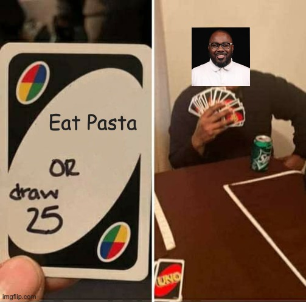 | [Reza Husain](https://github.com/rezahusain) | [source](https://imgflip.com/i/8uza46) |
|  | [Young Song](https://github.com/youngsong99) | [source](https://www.reddit.com/r/ProgrammerHumor/comments/kh4wpl/poor_ruby/) |
| | [Ray Gunawidjaja](https://github.com/rayguna) | [source](https://www.pinterest.com/pin/get-inspired-and-laugh-with-these-funny-motivational-memes--505880970652725669/)|
| 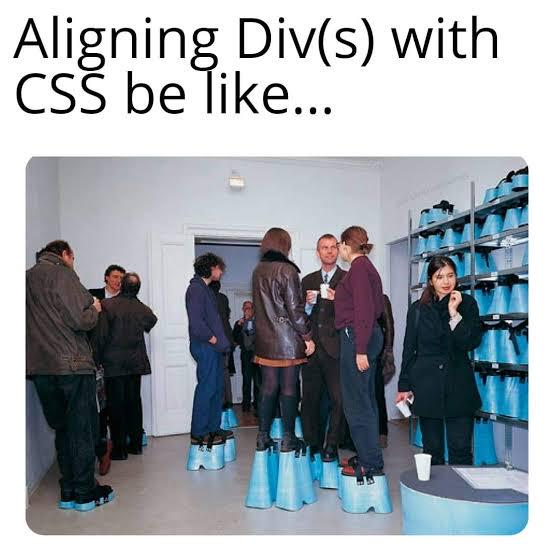 | [Ricardo Juarez](https://github.com/jrzricardo) | [source](https://www.reddit.com/r/programmingmemes/comments/1aw2kp2/_/#lightbox) |
| 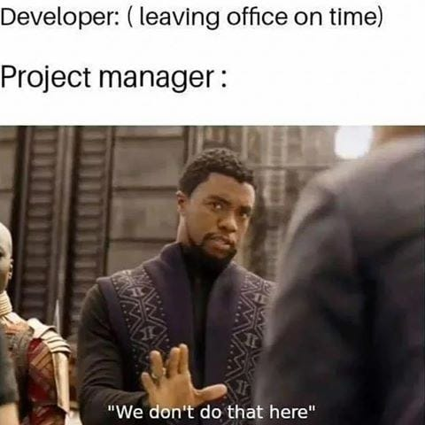 | [Kevin Calva](https://github.com/kcalva) | [source](https://file.forms.app/sitefile/55+Hilarious-developer-memes-that-will-leave-you-in-splits-9.jpeg) |
|  | [Kurt Mauritz] | [source](https://cheezburger.com/8944133/17-coding-memes-for-the-frustrated-software-engineer) |
|  | [Benny Joram](https://github.com/borvux) | [source](https://devcamp.com/site_blogs/top-5-programming-memes) |
| 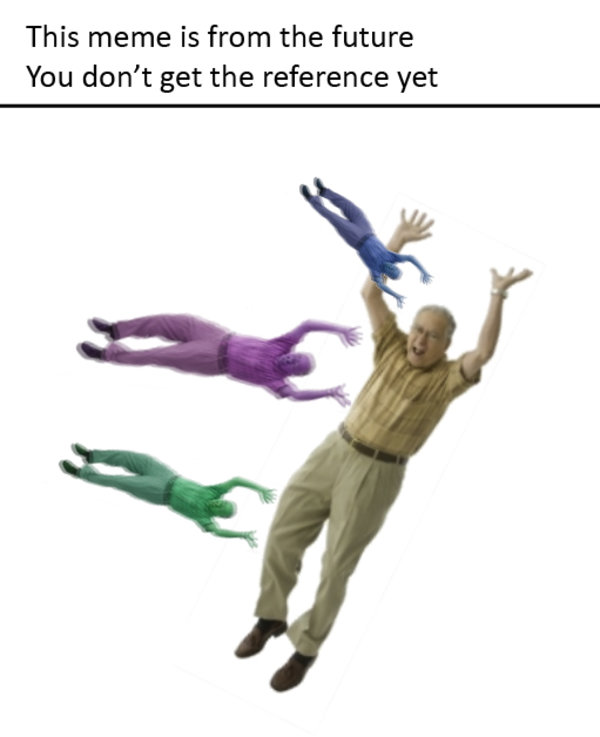 | [Herman Contreras](https://github.com/hcontr4) | [source](https://i.kym-cdn.com/entries/icons/original/000/021/782/meme.jpg) |
|  | [Kurt Mauritz](https://github.com/MauritzKurt) | [source](https://cheezburger.com/8944133/17-coding-memes-for-the-frustrated-software-engineer) |
|  | [Fadi Baker](https://github.come/FadiBaker92) | [source] https://www.zegocloud.com/blog/programming-memes |
|  | [Aleksei Borovikov](https://github.com/aborov) | [source](https://codingbootcamps.io/resources/our-favorite-programming-memes/) |
| 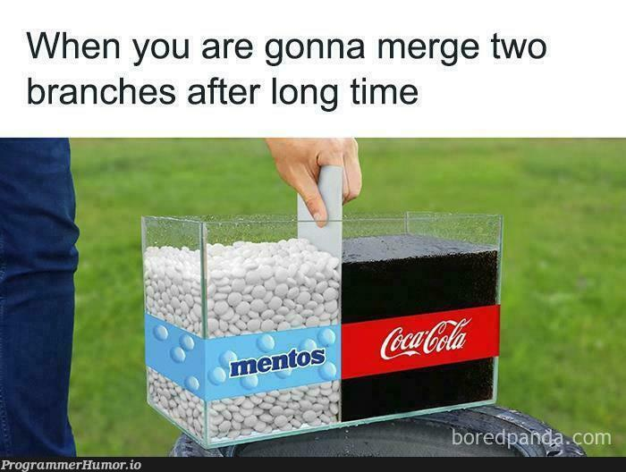 | [Brandon Varner](https://github.com/brvarner) | [source](https://programmerhumor.io/programming-memes/get-ready-for-the-big-bang/) |
|  | [Adolfo Nava](https://github.com/AdolfoNava) | [source](https://tenor.com/view/stack-overflow-close-tabs-and-it-works-build-success-coding-gif-17718518) |
| 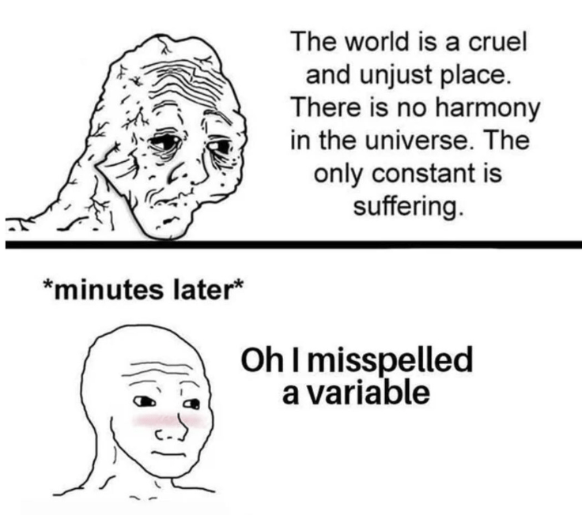 | [Jan Niewielski](https://github.com/jniewiel) | [source](https://i.chzbgr.com/full/9905641728/hC2734F9E/place-there-is-no-harmony-universe-only-constant-is-suffering-minutes-later-oh-misspelled-variable) |
| 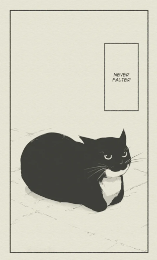 | [Dylan Sarikas](https://github.com/dylansarikas) | [source](https://knowyourmeme.com/photos/2781183-tyronestash) |
|  | [Maya Sheriff](https://github.com/MayaS1111) | [source](https://www.pinterest.com/pin/42925002689535117/) |
| 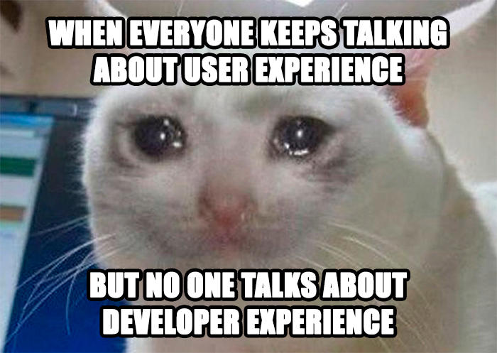 | [Jennifer Rahman](https://github.com/jb520) | [source](https://devhumor.com/media/developer-experience-matters-too) |
| 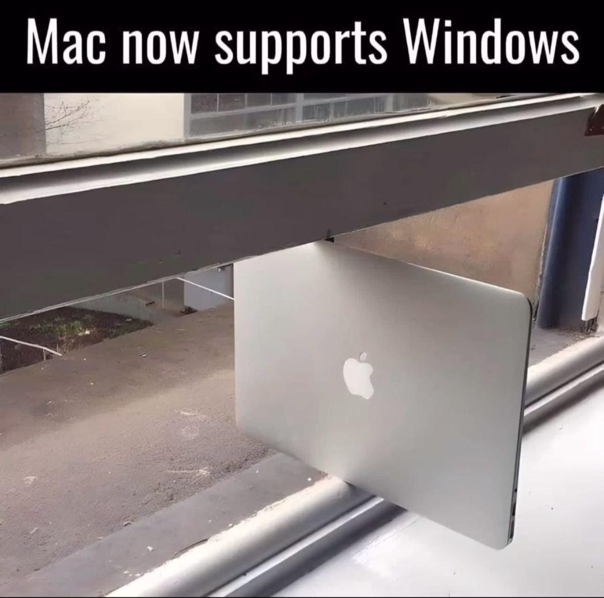 | [Jeremy Baxter](https://github.com/jt-is-coding) | [source](https://www.reddit.com/r/programmingmemes/comments/1deu5zq/mac/#lightbox) |
| 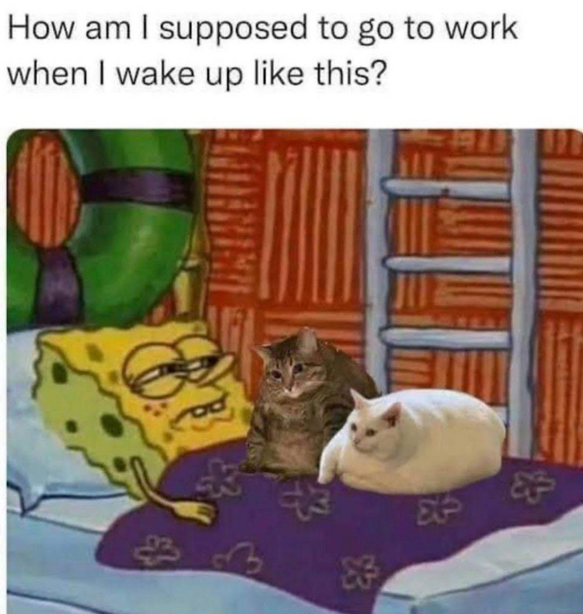 | [Natalie Demyanenko](https://github.com/SaraDawner2000) | [source](https://www.reddit.com/r/Catmeme/comments/ra13ah/me_when_i_wake_up_at_3_am_dying_of_thirst_but_my/) |
| 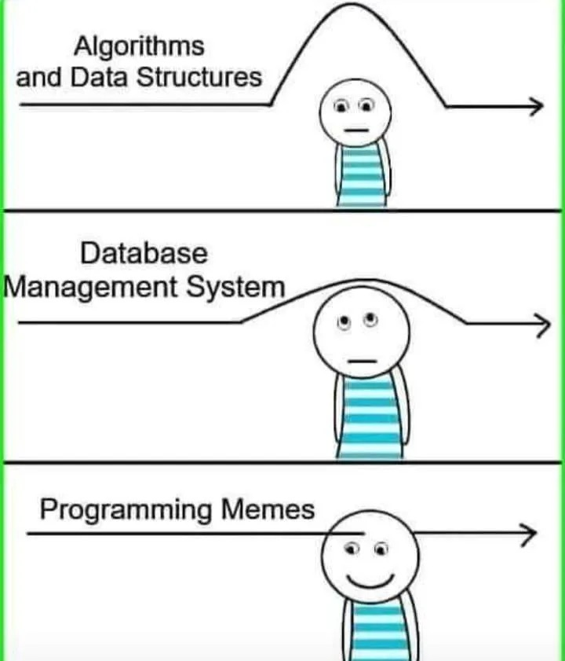| [Aizat Ibraimova](https://github.com/aizatibraimova) | [source](https://miro.medium.com/v2/resize:fit:4800/format:webp/1*1L-wyk1Kk2Dd-79gb0AvPw.jpeg) |
| | [Chinemelum Iloegbunam](https://github.com/Cindellai) | [source](https://imgflip.com/i/876xe6) |
|  | [Yusra Ahmed](https://github.com/phamdvincent) | [source](https://cdn-cekmh.nitrocdn.com/SlrtebQxNZbUBkfXeRIcTgUmxZsOSldb/assets/images/optimized/rev-8360286/codoid.com/wp-content/uploads/2023/02/Software-Development-Meme.jpg) |

# 2024-9-1-SDF
| Meme | Submitted By | Source |
| -------- | ------- | ------- |
| 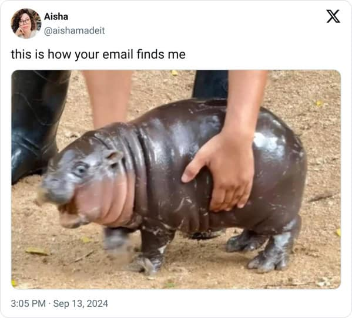 | [Ashanti Hatchett](https://github.com/hatcheta1) | [source](https://thunderdungeon.com/wp-content/uploads/2024/09/moo-deng-3-20240917.jpg) |
| 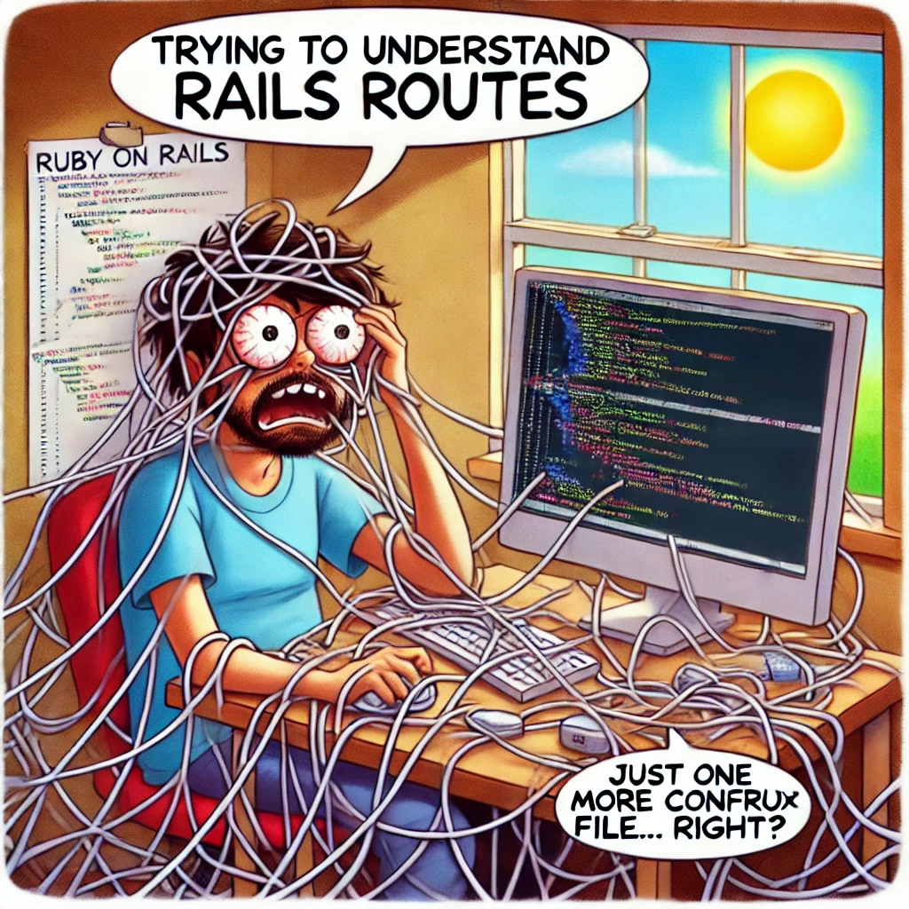 | [Brian Kim](https://github.com/bibimbop123) | [source](chatgpt.com) |
| 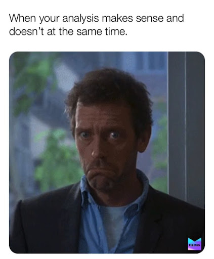| [Jessica JnoBaptiste](https://github.com/jessjno) | [source](https://file.forms.app/sitefile/35+Funny-market-research-memes-to-make-you-roll-with-laughter-28.jpeg)
|  | [Vivian Davila](https://github.com/viviancreates) | [source](https://jakewardmusician.medium.com/the-meme-dilemma-how-memes-help-to-destroy-creative-thought-and-popularize-ignorance-e5fa5f64d5a8) |
|  | [Anna Villarreal](https://github.com/AnnaVi11arrea1) | [source](https://www.friendsoftheanimalvillage.org/single-post/2014/12/18/15-cat-memes-to-brighten-your-day) |
|  | [Brian Luu](https://github.com/tluu5) | [sourse](https://unchainedcrypto.com/cat-themed-and-solana-meme-tokens-top-price-performance-in-last-24-hours/) |
|  | [Daniela Garcia](https://github.com/dgarcia13-99) | [source](https://benvenutiarts.com/meet-the-benvenuti-arts-team/spongebob-meme-1/)
|  | [Anna Villarreal](https://github.com/AnnaVi11arrea1) | [source](https://www.friendsoftheanimalvillage.org/single-post/2014/12/18/15-cat-memes-to-brighten-your-day) |
| 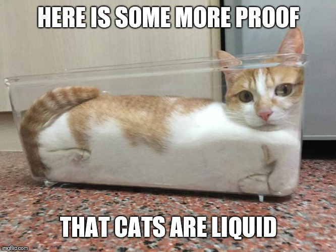 | [Margarita Potylitsyna](https://github.com/Ritumka) | [source](https://imgflip.com/i/33dz2i) |
|  | [Merrill Huang](https://github.com/merrillhuang) | [source](https://memebase.cheezburger.com/tag/computer-science-memes) |
| 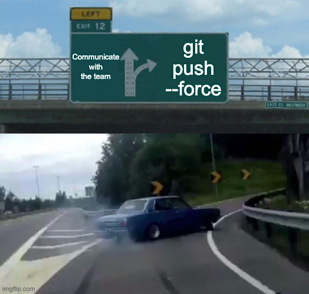 | [Tyler Estell](https://github.com/Testell) | [source](https://imgflip.com/i/95b49k) |
| 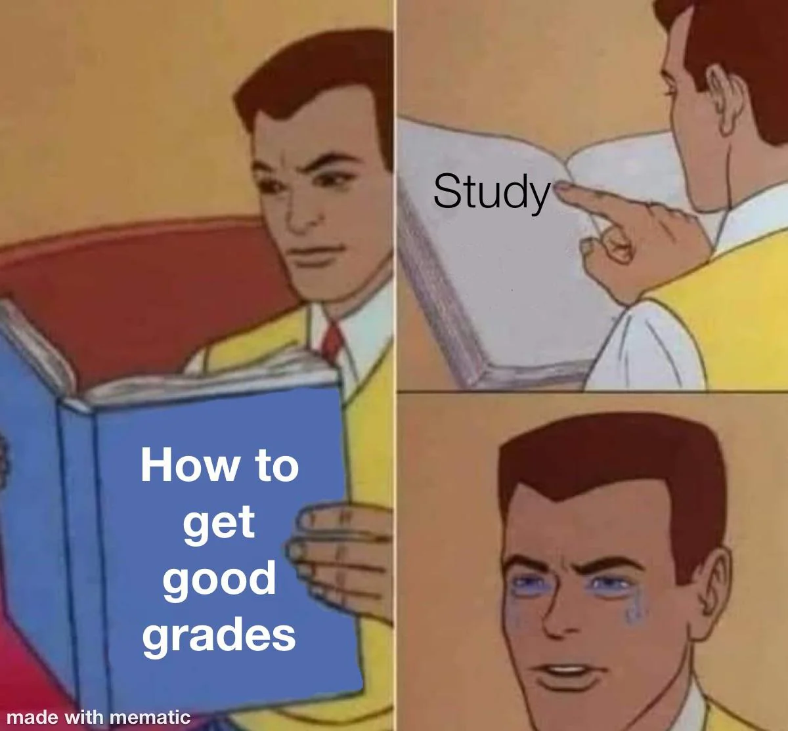 | [Djvon Simpson](https://github.com/dsimp) | [source](https://preview.redd.it/ialyt5m7kkv61.jpg?auto=webp&s=044d30a7eb13df677db6572d7127dcbd173d4719) |

# 2024-10-1-SDF
| Meme | Submitted By | Source |
| -------- | ------- | ------- |
|  | [Teresa Pham](https://github.com/teresa-c-pham) | [source](https://www.instagram.com/otterthepitbull/) |
| 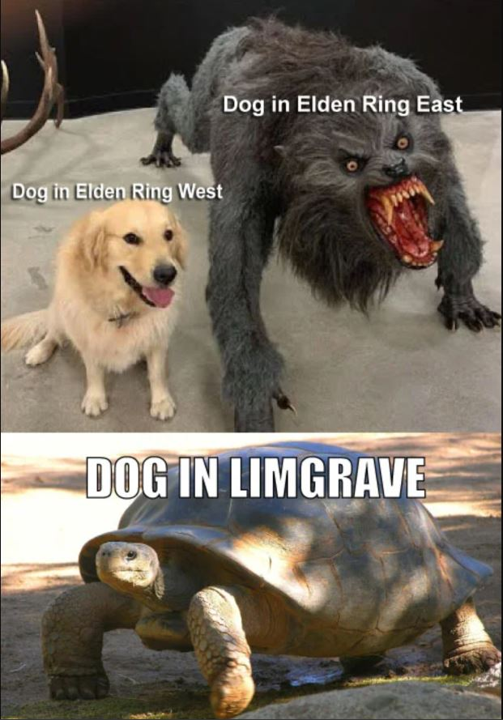 | [Jim Vongsouvanh](https://github.com/zer0mancer) | [source](https://cdn.ebaumsworld.com/2022/03/07/120035/87118266/elden-ring-memes21.png) |
|  | [Alonzo Rice](https://github.com/ricealonzo) | [source](https://www.reddit.com/r/funny/comments/9t4ae9/baby_looks_at_his_clone/#lightbox)
| 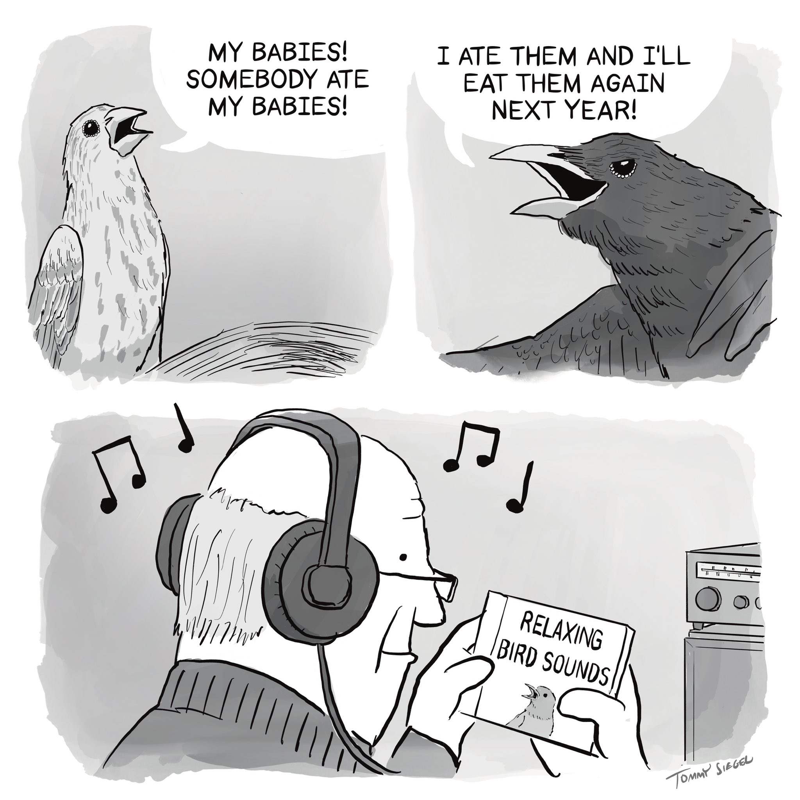 | [KieuThanhDiem Grace Do](https://github.com/grace1501) | [source](https://x.com/TommySiegel/status/1857805646755750000)
|  | [Max Montesino](https://github.com/m-nt-s-no) | [source](https://www.facebook.com/photo.php?fbid=1748245845307357&id=298385066960116&set=a.298401790291777) |
|  | [Mary Webby](https://github.com/marywebby) | [source](https://x.com/notgwendalupe/status/1868162603912237512?s=46) |
| 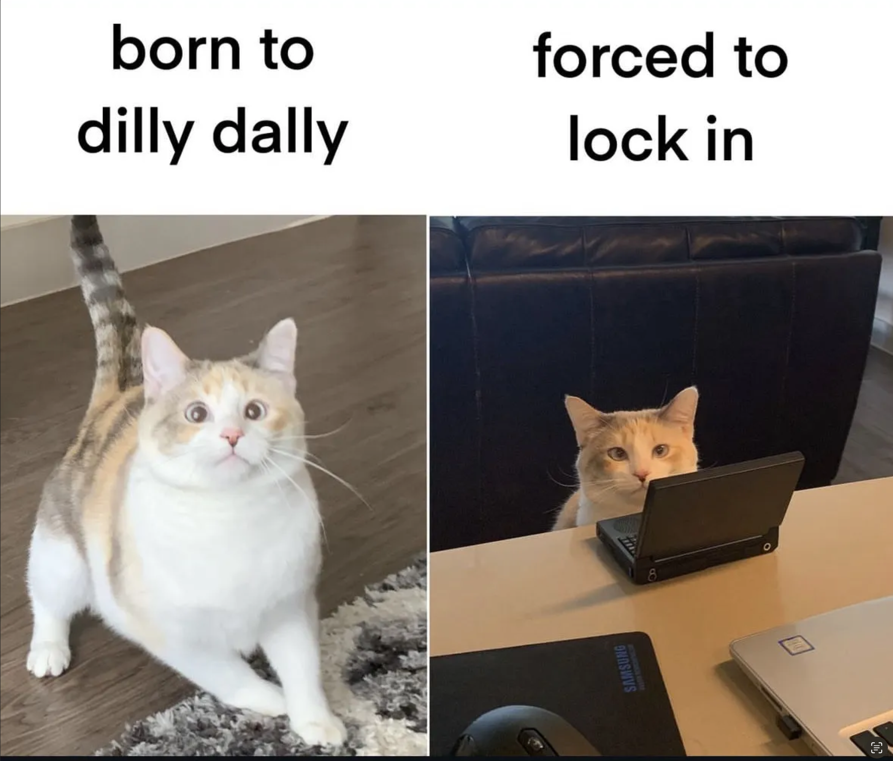 | [Aldo Portillo](https://github.com/aldoportillo) | [source](https://www.aldoportillo.com/) |

# 2025-03-1-SDF
| Meme | Submitted By | Source |
| -------- | ------- | ------- |
|  | [Gladys Toledo-Rodriguez](https://github.com/gtoledorodriguez) | [source](https://www.reddit.com/media?url=https%3A%2F%2Fpreview.redd.it%2Fhwi8eu3axp941.jpg%3Fauto%3Dwebp%26s%3D208508cf7eda61cfc6ff657d300b650e5f5a8b06) |
|  | [Federico Hernandez Nater](https://github.com/fhernandeznater) | [source](https://www.reddit.com/r/sbubby/comments/1eqrljz/i_scream_you_scream_we_all_scream_for_ice_cream/) |
|  | [Melissa Martinez](https://github.com/martinez415) | [source](https://www.reddit.com/r/ProgrammerHumor/comments/1jgd1rn/happensalltime/) |
|  | [Candide Mboungou-Kimpolo](https://github.com/Candide23) | [source](https://i.imgflip.com/6cne8j.jpg) |
|  | [Joel Hunt](https://github.com/trailsofink) | [source](https://www.theodysseyonline.com/media-library/image.jpg?id=14360537&width=763&quality=80) |
|  | [Sabreena Salomon](https://github.com/Sabreenasal) | [source](https://cleanmemes.com/) |
|  | [Mohamed Elhelw](https://github.com/melhelow) | [source](https://pleated-jeans.com/2025/01/21/funny-cat-memes-1-21-25/) |
|  | [Devlin Harvey](https://github.com/pdevlinharvey) | [source](https://www.reddit.com/r/pcmasterrace/comments/1c3mzcv/rookie_mistake/) |
| | [Miguel Ramos](https://github.com/Mrammoss)| [source](https://flat-icons.com/graphic-design-is-my-passion/)|
| | [Torell Pernell](https://github.com/torellpernell)| [source](https://www.reddit.com/r/ProgrammerHumor/comments/t598pg/i_love_bug_fixing_but_i_hate_when_im_not_able_to/)|
|  | [Bella Rose Wilson](https://github.com/bellarosewilson)| [source](https://tenor.com/search/everything-is-fine-meme-gifs)|
